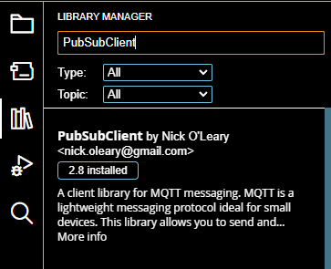
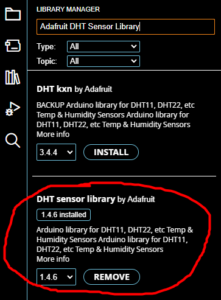

# WarehouseClimateControlHub

This project is an IoT-based solution developed for COMCS.Lda, a company that requires constant monitoring of temperature and humidity across its production, storage, and transportation stages to maintain product quality and ensure customer satisfaction.

The system integrates ESP32 devices with DHT11 sensors, Node-RED, and the MQTT protocol to enable real-time monitoring, data analysis, and alert management. It includes a centralized command center and an alert server, ensuring timely detection and reporting of fluctuations that may compromise product integrity.


# ESP32 Sensors and libraries installation

Install the most recent Arduino IDE to download the required libraries and flash the ESP32 Board - "https://www.arduino.cc/en/software"

after the installation go in to -> File -> Preferences and add this "https://espressif.github.io/arduino-esp32/package_esp32_dev_index.json"


Open Boards Manager from Tools > Board menu and install esp32 platform (and do not forget to select
your ESP32 board from Tools > Board menu after installation).
Select esp32 by Espressif Systems to install.


Now check if the UART Bridge is available


if its not available follow this guide to install de correct drivers

"https://docs.espressif.com/projects/esp-idf/en/latest/esp32/get-started/establish-serial-connection.html"
"https://www.silabs.com/developer-tools/usb-to-uart-bridge-vcp-drivers"

if the Device is still not available in the device manager, uninstall and restart the PC and try installing again.

Now in the select board choose the ESP32 Dev Module


After having all this installed, the ESP32 should work and we can upload our code to it.

But before that we need to install some libraries for the code to work.






Now that all the libraries are installed, we need to make change some settings to connect to our wifi

Input your wifi credentials

Make sure the Broker information is correct

and make sure the udp Address matches the one of your udp server, if you still dont have this address it will be explained in a later part of the setup instructions


# UDP Server 
To be able to make connections to the MQTT server with the UDP server you need to first enable sudo on your virtual machine and then install openssl with the following command:
- ```>>>: sudo apk add openssl-dev```

After that you need to install the mqtt library, first clone the repository of the library with the following command:
- ```>>>: sudo git clone https://github.com/eclipse/paho.mqtt.c.git```

Then navigate to the folder where you installed the library and run the following commands:
- ```>>>: cmake -Bbuild -H. -DPAHO_WITH_SSL=ON -DPAHO_BUILD_STATIC=ON -DPAHO_BUILD_SHARED=ON```
- ```>>>: cmake --build build/ --target install```
- 
 After this you have Paho library installed on your machine.
 
To make the Json parses this project is using the cJson library, but you don´t need to install it because it is already inside the project. If you want to read the documentation of this library you can visit the official github page of cJson:
- https://github.com/DaveGamble/cJSON

After this to run the UDP server open the folder UDP_server and execute the Makefile inside it with the following command on your terminal inside the folder:
- ```>>>: make```

After that the project will be built on a main file and you can execute it and run it by the comand:
- ```>>>: ./main```


# Node-Red installation

Node Red will be used to display the sensors information and alerts

To setup node red first download this already prepared virtual machine and install it

"https://moodle.isep.ipp.pt/mod/resource/view.php?id=224665"


after the installation go to settings, network and make sure it all matches the picture


If the rule doesn't exist, create the rule: TCP as a protocol, host IP= 127.0.0.1, Host Port 1880 and the
guest IP equal to the guest IP and the 1880 as the host port.
Change the “Shared folders” to map the folder on the physical disk.

after this start the virtual machine
Username: root
Password: toor

enter the command: "node-red"

open your browser and go to " localhost:1880"

after this click the 3 lines and open manage pallete


install the "node-red-dashboard"


Following this click the 3 lines again and import


and import the flow_final


after this you can open the dashboard


and click the arrow


